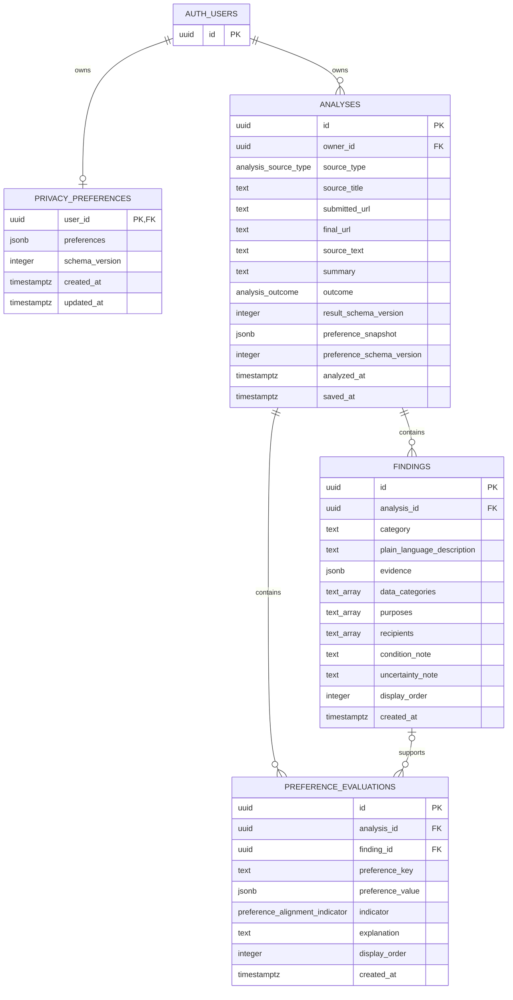

# MVP database design (issue #5)

This document defines the persisted data model for the ClearConsent MVP.
Supabase provides PostgreSQL, authentication, migrations, and row-level
security (RLS). Anonymous URL and pasted-text analyses remain temporary and do
not use these tables.

The schema supports saved privacy preferences, completed agreement analyses,
source-supported findings, personalized preference alignment, and analysis
history. It does not store document-specific question-and-answer history.

## Technology choice

ClearConsent uses Supabase PostgreSQL because it provides:

- Relational constraints for analysis ownership and supporting findings.
- Supabase Auth integration through `auth.users`.
- RLS policies based on the authenticated user's `auth.uid()`.
- Version-controlled SQL migrations and reproducible local development.
- An HTTPS Data API compatible with a SvelteKit application deployed on
  Cloudflare.

The application can use the public Supabase client configuration and the
signed-in user's session. A service-role key must never be exposed to browser
code because it bypasses RLS.

## Entity-relationship diagram



`AUTH_USERS` represents the Supabase-managed `auth.users` table. ClearConsent
does not duplicate authentication identity data in a public profile table for
the MVP.

## Table responsibilities

### `privacy_preferences`

Stores at most one current preference set for each authenticated user. The
JSON object allows the preference contract to evolve while `schema_version`
identifies the format used. An `updated_at` trigger records changes.

An absent row means that the user has not configured preferences. Preferences
must be a nonempty JSON object.

### `analyses`

Stores one completed analysis saved by an authenticated user. It preserves the
source text and result summary needed to reopen the result and display
source-linked evidence.

`source_type` distinguishes URL input from pasted text. URL analyses require a
submitted URL. Pasted-text analyses cannot contain submitted or final URLs.

`outcome` distinguishes a result with supported findings from a successful
analysis where no supported practices were identified. This avoids treating an
empty result as a processing failure.

When personalization is performed, `preference_snapshot` and
`preference_schema_version` preserve the exact preference context used for the
result. Both remain null for a non-personalized result.

### `findings`

Stores individual privacy practices supported by the analyzed source. Each
finding includes:

- A category such as collection, use, sharing, retention, or user choice.
- A plain-language description.
- A nonempty array of evidence objects.
- Structured data categories, purposes, and recipients.
- Optional conditions and uncertainty notes.
- A display order for deterministic presentation.

A finding is deleted automatically when its parent analysis is deleted. The
Data Footprint interface is derived from these structured findings rather than
stored as a separate table.

### `preference_evaluations`

Stores the interpretation of a finding against the preference snapshot used
for an analysis. The supported indicators are:

- `alignment`
- `conflict`
- `insufficient_evidence`

These indicators describe preference alignment only. They are not legal
conclusions and must not be presented as safe, unsafe, acceptable, or advice
to accept or reject an agreement.

Alignment and conflict rows must reference a supporting finding.
`insufficient_evidence` may use a null `finding_id` when the source contains no
finding that addresses the preference. A composite foreign key ensures that a
referenced finding belongs to the same analysis.

## Ownership and access control

RLS is enabled on every public table. Anonymous users have no privileges on
the persisted tables. Analyses completed without an authenticated owner remain
temporary and are not inserted into the persisted tables.

Authenticated access is limited as follows:

| Table                    | Select                 | Insert                 | Update  | Delete           |
| ------------------------ | ---------------------- | ---------------------- | ------- | ---------------- |
| `privacy_preferences`    | Own row                | Own row                | Own row | Own row          |
| `analyses`               | Own rows               | Own rows               | No      | Own rows         |
| `findings`               | Through owned analysis | Through owned analysis | No      | No direct delete |
| `preference_evaluations` | Through owned analysis | Through owned analysis | No      | No direct delete |

Saved analyses, findings, and evaluations are immutable. Deleting an analysis
cascades to its findings and preference evaluations. Deleting a Supabase Auth
user cascades to that user's preferences and analyses, followed by their child
records.

When an authenticated analysis becomes complete, the application assigns one
stable analysis UUID before the first persistence attempt and reuses that UUID
for every retry. The `analyses` primary key therefore acts as an idempotency
key and prevents the same completed result from becoming duplicate history
entries.

The application must save the analysis and all child records atomically. A
failed transaction must roll back every inserted row so incomplete results do
not appear in history. The exact API or database function used for that
transaction remains an implementation decision.

## Retention and deletion

The MVP has no automatic expiration period for saved analyses. Records remain
until the user deletes an analysis or deletes their account. This behavior
must be communicated in the interface.

Deletion behavior is:

1. Deleting an analysis removes its findings and preference evaluations.
2. Deleting an account removes its preferences and analyses.
3. Anonymous source text and question context are not persisted.
4. Document-specific questions and answers are not stored in the MVP.

A time-based retention policy, export workflow, and scheduled purge process
are deferred until the team establishes product requirements for them.

## Expected query patterns

Load the signed-in user's newest saved analyses:

```sql
select id, source_title, source_type, summary, outcome, saved_at
from public.analyses
where owner_id = auth.uid()
order by saved_at desc;
```

Load findings for one owned analysis:

```sql
select
  id,
  category,
  plain_language_description,
  evidence,
  data_categories,
  purposes,
  recipients,
  condition_note,
  uncertainty_note
from public.findings
where analysis_id = $1
order by display_order, id;
```

Build a basic Data Footprint summary:

```sql
select category, count(*) as finding_count
from public.findings
where analysis_id = $1
group by category
order by category;
```

Load preference-alignment results:

```sql
select
  preference_key,
  preference_value,
  indicator,
  explanation,
  finding_id
from public.preference_evaluations
where analysis_id = $1
order by display_order, id;
```

Delete an owned saved analysis:

```sql
delete from public.analyses
where id = $1
  and owner_id = auth.uid();
```

RLS provides the final ownership check even when an application query omits an
explicit owner filter.

## Synthetic local data

`supabase/seed.sql` creates deterministic, synthetic records for local
development:

- Two UUID-only Auth records that are not login accounts.
- One saved preference set owned by the first user.
- One pasted-text analysis with three source-supported findings.
- Four preference evaluations: one alignment, two conflicts, and one
  insufficient-evidence result.
- No persisted data owned by the second user, allowing RLS isolation checks.

After a reset, the expected counts are:

| Record type            | Count |
| ---------------------- | ----: |
| Auth users             |     2 |
| Preference sets        |     1 |
| Analyses               |     1 |
| Findings               |     3 |
| Preference evaluations |     4 |

## Local setup and verification

Docker Desktop or another Docker-compatible runtime must be running. From the
repository root, start Supabase:

```sh
npx supabase start
```

Recreate the local database, apply all migrations, and load the seed:

```sh
npx supabase db reset
```

Lint the local schema:

```sh
npx supabase db lint --local --level warning --fail-on warning
```

A reset deletes local database changes and reconstructs the database from the
committed migration and seed files. The seed must contain synthetic data only;
credentials, tokens, and production data must never be committed.

Create future schema changes as new migrations:

```sh
npx supabase migration new descriptive_change_name
```

## Verification results

The initial migration was verified locally by:

- Rebuilding the database from an empty local state.
- Loading all synthetic records without constraint or foreign-key errors.
- Running the Supabase database linter with no schema warnings.
- Confirming RLS on all four public tables.
- Confirming the exact authenticated table privileges.
- Confirming the owner sees `1` preference, `1` analysis, `3` findings, and
  `4` evaluations.
- Confirming the second authenticated user sees zero of those rows.
- Confirming the anonymous role receives `permission denied` for persisted
  analyses.

## Deferred decisions

The following decisions require coordination with the shared application and
AI data contracts:

- Final accepted values for finding categories, data categories, purposes, and
  recipients.
- The final evidence-object schema and whether character offsets use bytes,
  Unicode code points, or another indexing convention.
- The final preference JSON schema and its version-migration strategy.
- The atomic persistence boundary for an analysis and all child records.
- Whether saved source text receives a time-based retention limit.
- Whether future versions support result export or account-level bulk deletion.
- When generated TypeScript database types become part of the build process.

Separate profile, uploaded-document, Data Footprint, and conversation-history
tables are intentionally omitted from the MVP. Authentication identity remains
in Supabase Auth, each analysis contains one source, the Data Footprint is
derived from findings, and document-specific questions are temporary.
