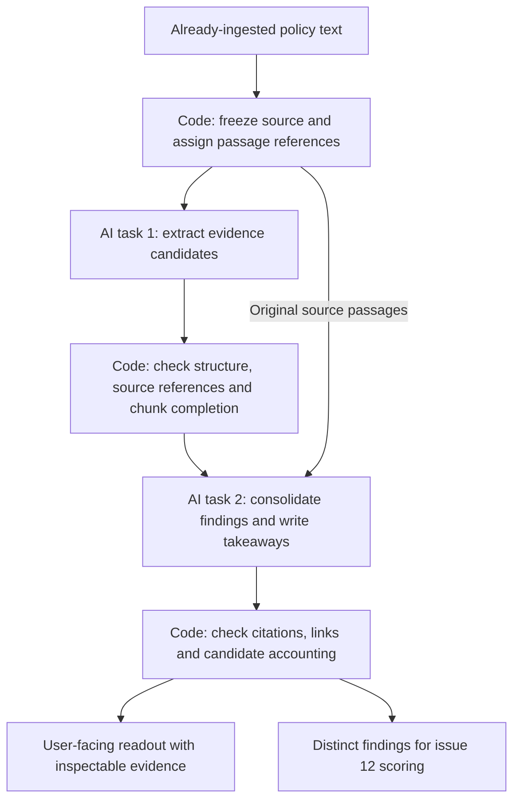

# Proposal: Two-stage AI policy analysis

**Issue:** [#17 — AI workflow from ingested policy text to output](https://github.com/UNLV-CS472-672/2026-F-GROUP2-ClearConsent/issues/17)

**Status:** Proposed for team review

**Updated:** October 1, 2026

## What we are proposing

Use Luna at medium reasoning as the starting candidate for two AI tasks:

1. **Extract evidence:** Read the policy text and identify the privacy practices it supports.
2. **Consolidate and explain:** Use those candidates and the original text to produce distinct findings and a readable set of takeaways.

Code validates the references and result structure between and after the AI tasks. The final readout keeps each explanation connected to its source, with `reason` before `label`.

The proposal begins with **already-ingested policy text**. URL retrieval, webpage parsing, and capturing pasted text belong upstream. This document proposes the analysis flow and team handoffs; it does not establish a finished implementation or a validated quality result.

## Why this workflow

The exploratory work in #11 showed that Luna can identify useful policy statements, but finding more statements does not automatically produce a better explanation.

| Existing experiment                           | What it showed                                                                                                                 | What the proposal addresses                                                               |
| --------------------------------------------- | ------------------------------------------------------------------------------------------------------------------------------ | ----------------------------------------------------------------------------------------- |
| [Sectioned full-policy extraction][sectioned] | 229 candidate findings across two policies, with overlap and one invalid citation.                                             | Keep evidence available while consolidating repeated practices and validating references. |
| [Manual spot-check][review]                   | Some recipient fields confused advertisers, collaborators, or the policy owner with actual recipients.                         | Check interpretations against the source; naming a party does not establish a disclosure. |
| [Spotify consolidation][consolidation]        | 73 candidates became nine takeaways, but compression omitted material points and broadened one qualification.                  | Preserve a full findings inventory and record what happened to every candidate.           |
| [Direct Spotify readout][direct]              | A single call produced a usable readout and caught some details the consolidation pass omitted, with citation gaps of its own. | Keep direct processing as the baseline for a fair workflow comparison.                    |

The reason to propose two stages is that evidence extraction and presentation become separately inspectable and reusable. Existing runs used different prompts and budgets, so they do not prove that two stages outperform one. The extra AI task adds cost, latency, and another opportunity to lose detail.

## Workflow at a glance

| Step             | Who handles it | What comes out                                                                                   |
| ---------------- | -------------- | ------------------------------------------------------------------------------------------------ |
| Prepare source   | Code           | An unchanged text snapshot with stable passage references.                                       |
| Extract evidence | AI task 1      | Candidate practices, supporting passages, conditions, and uncertainty.                           |
| Check references | Code           | A structurally valid extraction result or an explicit processing error.                          |
| Consolidate      | AI task 2      | Distinct findings, readable takeaways, and candidate-to-finding mappings.                        |
| Check output     | Code           | Valid references and links, with every candidate and required chunk accounted for.               |
| Present results  | Results view   | Concise explanations, attention labels, and access to the complete findings and source excerpts. |

### AI task 1: extract evidence

The model identifies significant collection, use, sharing, sale, retention, deletion, and user-choice practices. It also preserves explicit denials, exceptions, conflicting statements, and ambiguity.

Each candidate needs a claim, descriptive category/practice, and the source passages supporting both the claim and its qualifications. Data categories, purposes, and recipients are populated only where the text supports them. A company using its own data, an advertiser paying for ads, or a research collaborator is not automatically a recipient of personal data.

Unknown details remain unknown. For example, “we do not sell personal data” does not mean “we never share personal data.”

### AI task 2: consolidate and explain

The model receives the validated candidates **and original source material**. It produces:

- **Distinct findings:** Merge genuine repetition while retaining different practices, audiences, conditions, and exceptions.
- **Readable takeaways:** Group important findings into concise explanations with inspectable evidence.
- **Candidate accounting:** Map every candidate to a retained/merged finding or an explicit exclusion with a reason.

Keep material supported facts in the findings inventory even when they are omitted from the opening readout. Do not force an exact takeaway count or discard qualifications to make the result shorter.

The mapping makes compression reviewable. It cannot prove that the model made the right merge or exclusion, and it cannot reveal a practice missed during extraction. Those questions still require review against the original text.

## What the user sees

Each takeaway contains a topic, a plain-language `reason`, then an attention `label`, plus links to its findings and supporting passages. The reason explains the statement, important conditions, and why it deserves that label.

| Label            | Intended meaning                                                                                      |
| ---------------- | ----------------------------------------------------------------------------------------------------- |
| `positive`       | A protection or control explicitly described in the policy, with its limits.                          |
| `worth_knowing`  | A material practice or tradeoff the reader should understand.                                         |
| `higher_concern` | A practice warrants closer attention; the reason explains its sensitivity, reach, or limited control. |
| `unclear`        | Ambiguity, conflicting wording, or an unspecified limit prevents a definite interpretation.           |

These are general reader-attention labels. Personalized risk indicators and scores are handled separately by #12 using the distinct findings and the user's saved preferences.

## Worked example: text → evidence → readout

The following example is **handcrafted to illustrate the proposal**. It is not a model response or an evaluation result.

### Supplied text

| Passage | Original wording                                                                                                              |
| ------- | ----------------------------------------------------------------------------------------------------------------------------- |
| P1      | We collect approximate location from your IP address to operate the service.                                                  |
| P2      | We share approximate location with advertising partners only if you enable personalized ads.                                  |
| P3      | You can disable personalized ads in Settings; this stops that sharing.                                                        |
| P4      | We do not sell personal data.                                                                                                 |
| P5      | We delete your account data within 30 days of a verified deletion request, except records we must keep for legal obligations. |
| P6      | We retain usage logs for as long as needed to improve the service.                                                            |
| P7      | Advertising partners receive approximate location only when personalized ads are enabled.                                     |

### Extraction candidates

| Candidate | Candidate claim                                                                          | Cited passage |
| --------- | ---------------------------------------------------------------------------------------- | ------------- |
| C1        | Collect approximate location for service operation.                                      | P1            |
| C2        | Share approximate location with advertising partners when personalized ads are enabled.  | P2            |
| C3        | Disabling personalized ads stops that sharing.                                           | P3            |
| C4        | Personal data is not sold.                                                               | P4            |
| C5        | Delete account data within 30 days of a verified request, with a legal-record exception. | P5            |
| C6        | Retain usage logs for service improvement, with no fixed deadline stated.                | P6            |
| C7        | Advertising partners receive approximate location when personalized ads are enabled.     | P7            |
| C8        | Approximate location is sold to data brokers.                                            | P2            |

**C8 is an intentional defect.** P2 exists, so an ID-existence check would pass. But the passage does not support sale to data brokers. The illustrated consolidation excludes C8 after checking the source; this does not demonstrate that a real model will reliably catch the error.

### Consolidated findings

Eight candidates become five distinct findings:

| Finding                              | Candidates | What survives                                                                             | Source     |
| ------------------------------------ | ---------- | ----------------------------------------------------------------------------------------- | ---------- |
| F1 — Location collection             | C1         | Approximate location comes from the IP address and is used to operate the service.        | P1         |
| F2 — Conditional advertising sharing | C2, C3, C7 | Sharing occurs only when personalized ads are enabled, and disabling them stops it.       | P2, P3, P7 |
| F3 — No-sale statement               | C4         | The explicit no-sale statement remains distinct from the separately described sharing.    | P4, P2     |
| F4 — Deletion with an exception      | C5         | The 30-day deadline starts with a verified request and excludes legally required records. | P5         |
| F5 — Unspecified log retention       | C6         | The retention purpose is stated, but its duration remains unclear.                        | P6         |

C8 is excluded with the reason: “The cited text describes conditional sharing with advertising partners, not sale to data brokers.”

The repeated advertising clause is merged; the control and deletion exception remain visible. F5 is flagged ambiguous and passed to #12's needs-review list rather than contributing to a personalized score.

### Readable takeaways

Five findings become four grouped takeaways. The complete findings remain available for inspection.

| Reason                                                                                                                                                                                                                                                                         | Label            | Evidence                |
| ------------------------------------------------------------------------------------------------------------------------------------------------------------------------------------------------------------------------------------------------------------------------------ | ---------------- | ----------------------- |
| The policy collects approximate location for service operation and shares it with advertising partners only when personalized ads are enabled. Disabling those ads stops the sharing. Sending location to another party deserves attention, with the stated control preserved. | `higher_concern` | F1, F2 · P1, P2, P3, P7 |
| The policy explicitly says personal data is not sold. This is a stated protection, while the conditional advertising disclosure still applies.                                                                                                                                 | `positive`       | F3, F2 · P4, P2         |
| Account data is deleted within 30 days of a verified deletion request, except legally required records. The deadline has both a verification condition and a legal-record exception.                                                                                           | `worth_knowing`  | F4 · P5                 |
| Usage logs are kept for service improvement “for as long as needed.” The text gives no fixed deadline, so the duration remains unclear.                                                                                                                                        | `unclear`        | F5 · P6                 |

## Evidence and validation

Freeze the exact supplied text before assigning passage references. Preserve available source metadata and identify pasted text as pasted text; missing URLs or effective dates stay unknown.

The server maps passage IDs to character ranges and copies excerpts directly from that snapshot. Propose start-inclusive, end-exclusive UTF-16 offsets for the TypeScript contract, subject to agreement with #6/#12. Do not trust model-generated offsets or rewritten source quotes.

Code validates result structure, known nonblank references, citation bounds, source identity, unique IDs, finding/takeaway links, completion of required chunks, and candidate accounting. A failed check leaves the affected stage incomplete.

These checks establish structure and traceability. They cannot establish that a passage supports an interpretation, a recipient is correct, a caveat survived, or every material practice was found. The worked example's C8 shows that distinction.

## Long policies, cost, and latency

Two AI tasks do not always mean two API calls. A supported short policy can use one extraction call and one consolidation call. A long policy may need **N extraction calls + one consolidation call**.

Divide supported long text into core ranges with neighboring context for qualifications. Preserve source IDs and track every required chunk. Overlapping context does not count as extra coverage, and a failed chunk prevents the result from being marked complete.

For consolidation, supply the full source when it fits, otherwise the cited passages and relevant context. If the assembled request exceeds its supported limit, report that limit rather than recursively compressing away the evidence.

Before implementation, agree on source/input/output limits, chunk count, concurrency, timeouts, the overall deadline, and a whole-analysis budget covering both AI stages, failed attempts, and any approved retries. Propose zero automatic paid retries and no silent model or reasoning-effort escalation. Compare **total workflow cost and latency**, not just the price of consolidation.

## Failure and empty-result behavior

| Situation                                        | Proposed behavior                                                                         |
| ------------------------------------------------ | ----------------------------------------------------------------------------------------- |
| A candidate cites an unknown passage such as P99 | Reject that stage result; do not continue with an apparently complete readout.            |
| Consolidation times out                          | Keep available extraction work visibly incomplete; no completed summary or history entry. |
| A required extraction chunk fails                | Mark analysis incomplete rather than representing partial coverage as full analysis.      |
| All stages complete with no supported findings   | Explicitly report the source-limited no-findings outcome; do not imply low risk.          |
| The source is ambiguous or missing a detail      | Preserve uncertainty and explain the evidence gap.                                        |
| Input or processing exceeds configured limits    | Report the supported limit; do not silently truncate the text.                            |
| Personalized scoring or saving fails             | Keep available general results visible and identify the component that failed.            |

Policy text is untrusted data. Embedded instructions must not change stage instructions, budgets, model configuration, or document access. Keep these calls scoped to the supplied document, with no external tools. Log stage status, timings, usage, and sanitized errors while excluding credentials and full submitted text.

## Team handoffs

This proposal follows the [MVP functional requirements](../../requirements/detailed-functional-requirements.md). The final shared types and exact field meanings need agreement with their owners.

| Related work                        | Decision or handoff                                                                                                                        |
| ----------------------------------- | ------------------------------------------------------------------------------------------------------------------------------------------ |
| #6 — Analysis contracts and results | Agree on source/version identity, finding categories, citations, ambiguity/confidence, reason/label fields, and incomplete/error outcomes. |
| #7 — Server-side model access       | Implement the agreed stages through the server client with configurable model settings, bounded calls, and response validation.            |
| #12 — Personalized scoring          | Consume distinct findings. Keep ambiguous or uncited findings in the review list; do not score raw candidates or attention labels.         |
| #11 — Evaluation                    | Review the model configuration and compare direct versus staged analysis using agreed cases and criteria.                                  |

Document-specific questions and saved history should retain the same authorized source snapshot. A summary alone is not complete evidence for later questions.

A general analysis is complete when extraction and the summary succeed and pass structural/reference checks. When saved preferences are available, the overall personalized analysis also requires scoring to succeed. Saving is confirmed separately by persistence.

## How we decide whether to adopt it

Keep a direct one-pass flow as the baseline, using the same source text, model/effort, final output contract, and review criteria. Compare factual support, material coverage, preserved caveats, recipient accuracy, readability, label quality, total cost, and latency.

The [review plan](evaluation.md) describes the proposed cases, grading, decision gates, and implementation follow-ups. It is future work; this proposal runs no evaluations.

Adopt two stages only if the reviewed quality benefit justifies the extra overhead without reducing material coverage or qualification preservation. If direct processing meets the same requirements more cheaply, it remains a viable choice.

### Decisions for team review

- [ ] Is this separation of extraction and consolidation the right starting architecture?
- [ ] Do #6/#12 owners agree on distinct findings, source references, ambiguity/confidence, and attention labels?
- [ ] What source-size, call-count, cost, and latency limits should the implementation support?
- [ ] What material practices and exceptions must the evaluation preserve?
- [ ] Do owners agree on stage completion, retry behavior, and downstream scoring/results handoffs?

Once the proposal is agreed, follow up with contract alignment, source/chunk planning, server orchestration, and a controlled workflow comparison before integration.

[sectioned]: https://github.com/ethanvfour/2026-F-GROUP2-ClearConsent/blob/194c1cf6ff6e514d10f4e8ba315164944cd8dc53/tests/eval/issue-11/reports/LUNA_SECTIONED_FULL_RUN_2026-09-24.md
[review]: https://github.com/ethanvfour/2026-F-GROUP2-ClearConsent/blob/194c1cf6ff6e514d10f4e8ba315164944cd8dc53/tests/eval/issue-11/reports/LUNA_SECTIONED_REVIEW_2026-09-24.md
[consolidation]: https://github.com/ethanvfour/2026-F-GROUP2-ClearConsent/blob/194c1cf6ff6e514d10f4e8ba315164944cd8dc53/tests/eval/issue-11/reports/LUNA_LABELED_SPOTIFY_READOUT_2026-09-24.md
[direct]: https://github.com/ethanvfour/2026-F-GROUP2-ClearConsent/blob/194c1cf6ff6e514d10f4e8ba315164944cd8dc53/tests/eval/issue-11/reports/LUNA_DIRECT_LABELED_SPOTIFY_2026-09-24.md
